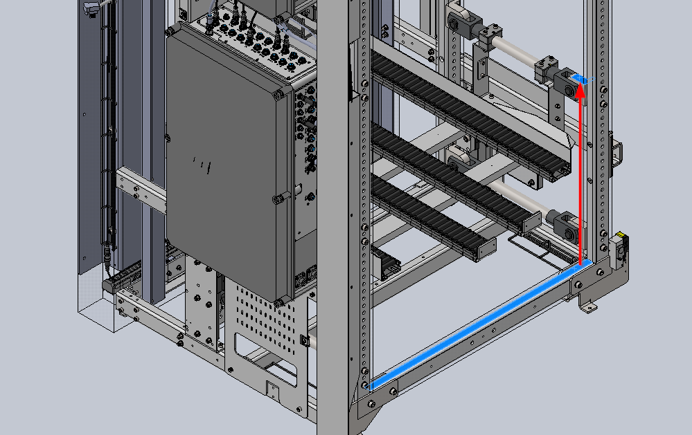

Backpack Layer Height Measurement
===

To configure the height of a layer installed in the backpack, use the bottom 
horizontal front bar of the backpack as a reference and measure up to the top 
surface of the respective layer mount (see picture below).

Then enter the value in the z_offset parameter of the respective layer in 
[soto_backpack_5_1_descriptions.yaml](config/soto_backpack_5_1_description.yaml).
